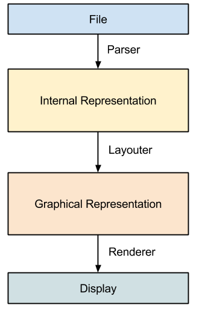

# scorejs

## Architecture

The following diagram illustrates the basic components of the software:

It consists of three data structures and three data processors. The diagram is intentionally generic in order to be able to plug-in different components.

### File

A file is a representation of a musical work in some specific format. Common file formats for representing music are MusicXML, MIDI, ABC notation and there are many more.

### Parser

A parser is a software component that is able to read a file and transform it to a canonical internal in-memory representation that can be manipulated.

### Internal Representation

The internal representation of music is a flexible hierarchical datastructure that is represented as a tree of nodes, where each node corresponds to a musical entity such as for example staffs, bars, notes, articulation and so on. Note that this representation does not include layout information, i.e. where exactly to place each of the items.

### Layouter

A layouter transforms the internal representation tree and creates a set of graphical objects that correspond to the musical elements in the tree. Note that a layouter might produce different results for the same internal representation depending on configuration paramters such as zoom level.

### Graphical Representation

The graphical representation is an abstract description of all the musical elements (stems, slurs, accidentials). Each element has a position.

### Renderer

A renderer creates an image based on a graphical representation. Renderers could output images such as PNG, SVG, but also directly draw onto a surface such as a canvas (possibly using an OpenGL Context).
